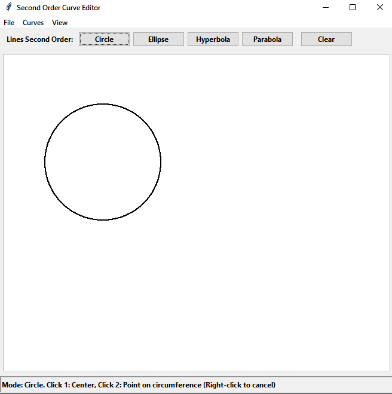

## Лабораторная работа №2

### Тема
Генерация кривых второго порядка.

### Задание:
Разработать элементарный графический редактор, реализующий построение линий второго порядка: окружность, эллипс, гипербола, парабола. Выбор кривой задается из пункта меню и
доступно через панель инструментов «Curve». В редакторе кроме режима генерации линий второго порядка в пользовательском окне должен быть предусмотрен
отладочный режим, где отображается пошаговое решение на дискретной сетке.

### Интерфейс

### Технологии
Python\
Tkinter

### Вывод
В результате выполнения был реализован функционал для отрисовки кривых второго порядка: Круг, Элипс, Гипербола и Парабола.