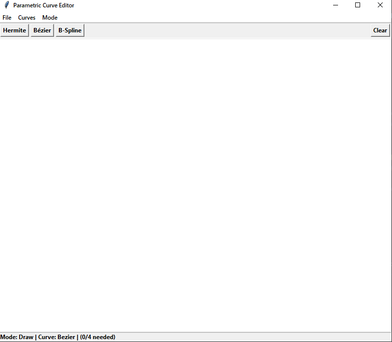

## Лабораторная работа №3

### Тема
Построение кривых.

### Задание
Разработать элементарный графический редактор, реализующий построение параметрических кривых, используя форму Эрмита, форму Безье и B-сплайн. Выбор метода
задается из пункта меню и доступно через панель инструментов «Кривые». В редакторе должен быть предусмотрен режим корректировки опорных точек и состыковка сегментов. В
программной реализации необходимо реализовать базовые функции матричных вычислений.

### Интерфейс

### Технологии
Python\
Tkinter

### Вывод
В результате выполнения был реализован функционал для отрисовки кривых, используя форму Эрмита, форму Безье и B-сплайн.