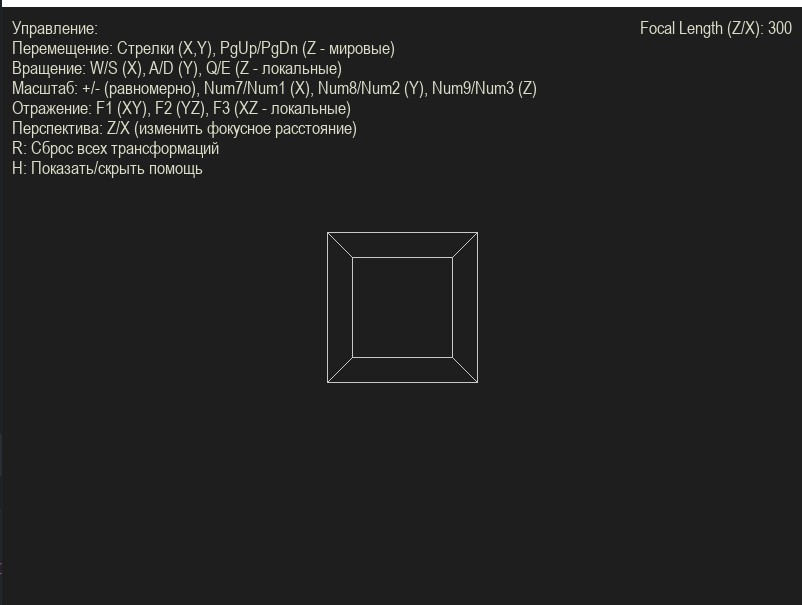

## Лабораторная работа №4

### Тема
Геометрические преобразования. 

### Задание
Разработать элементарный графический редактор, реализующий геометрические преобразования в двумерном и трехмерном пространстве, а также перспективные
преобразования. Для выполнения базовых геометрических преобразований разработать панель управления. В редакторе предусмотреть отладочный режим. 

### Интерфейс

### Технологии
Python\
PyGame + OpenGL