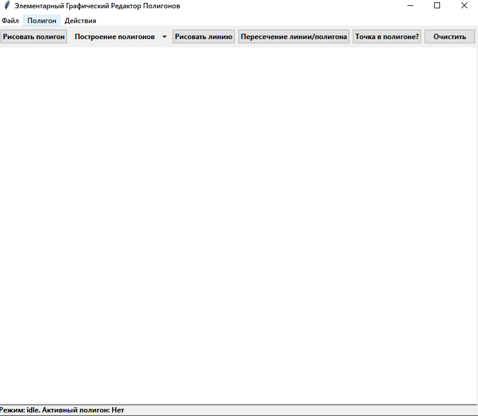

## Лабораторная работа №5

### Тема
Построение полигонов. 

### Задание
Разработать элементарный графический редактор, реализующий алгоритмы построния полигонов Джарвиса и Грэхема. 
Для выполнения базовых геометрических преобразований разработать панель управления. В редакторе предусмотреть отладочный режим. 

### Интерфейс

### Технологии
Python\
Tkinter

### Вывод
В результате выполнения был реализован функционал для отрисовки полигонов, используя алгоритмы, Джарвиса и и Грэхема.