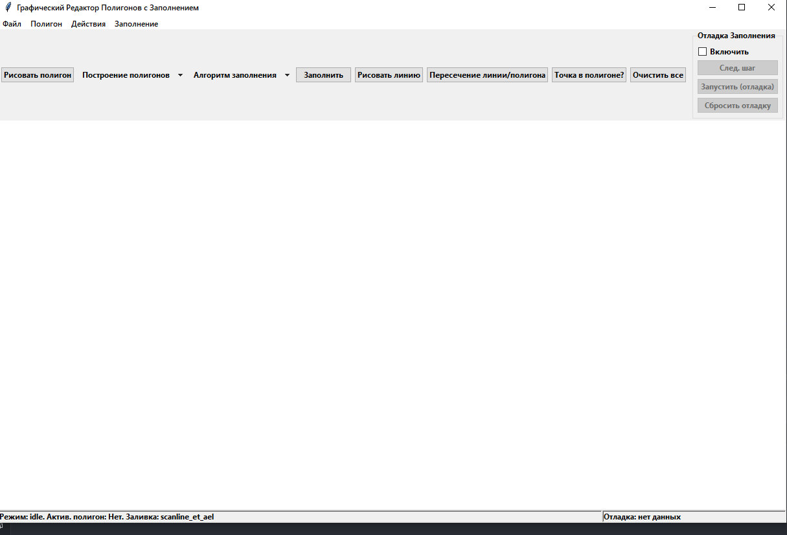

## Лабораторная работа №6

### Тема
Реализация алгоритмов заливки. 

### Задание
Разработать элементарный графический редактор, реализующий алгоритмы заливки полигонов ET, AEL, Flood, Line-by-Line. 
Для выполнения базовых геометрических преобразований разработать панель управления. В редакторе предусмотреть отладочный режим. 

### Интерфейс

### Технологии
Python\
Tkinter

### Вывод
В результате выполнения был реализован функционал для заливки полигонов, используя алгоритмы ET, AEL, Flood, Line-by-Line.