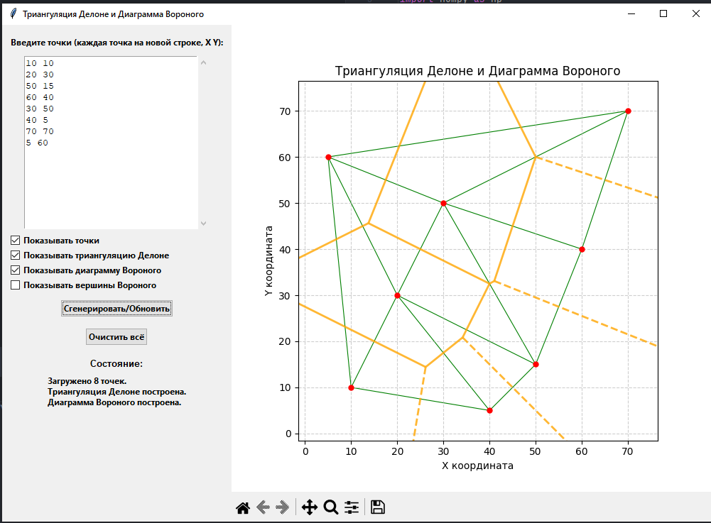

## Лабораторная работа №7

### Тема
Реализация алгоритмов посторения триангуляции Делоне и диаграммы Вороного.

### Задание
Разработать элементарный графический редактор, реализующий алгоритмы посторения триангуляции Делоне и диаграммы Вороного. 
Для выполнения базовых геометрических преобразований разработать панель управления. В редакторе предусмотреть отладочный режим. 
### Интерфейс

### Технологии
Python\
Tkinter

### Вывод
В результате выполнения был реализован функционал для посторения триангуляции Делоне и диаграммы Вороного.